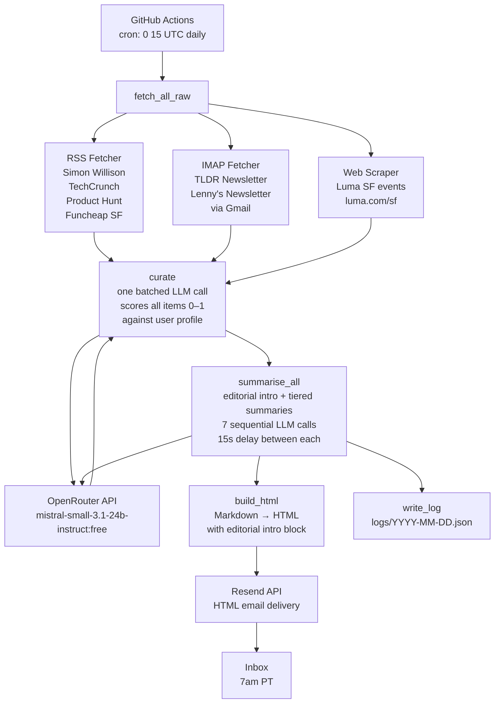

# Daily Digest

An automated personal morning email digest delivered at 7am PT via GitHub Actions. Instead of opening 7+ tabs every morning, I get a single consolidated HTML email summarising everything I care about — AI news, tech funding, new products, newsletters, and SF events.

---

## Motivation

I found myself spending 20–30 minutes each morning context-switching between Simon Willison's blog, my TLDR newsletter, TechCrunch, Product Hunt, and a handful of local SF event sites. Most days I'd miss something, or run out of time before getting to it all.

This project collapses all of that into a single email that's waiting in my inbox at 7am. It's not trying to replace deep reading — it's a triage layer so I know what's worth opening.

---

## Architecture (v1.5)

v1.5 adds an agentic **curate** step between fetch and summarise. The LLM now decides what's worth including, not just how to summarise it.



**Pipeline:** `fetch → curate (score + filter + rank) → summarise (editorial) → format → send`

---

## Data Sources

| Section | Source | Fetch Method | Status |
|---------|--------|--------------|--------|
| AI News: Simon Willison | simonwillison.net/atom/everything | RSS | ✅ Working |
| AI News: TLDR | Gmail inbox | IMAP + App Password | ✅ Working |
| Tech & Funding: TechCrunch | techcrunch.com/tag/venture/feed | RSS | ✅ Working |
| Tech & Product: Product Hunt | producthunt.com/feed | RSS | ✅ Working |
| Product: Lenny's Newsletter | Gmail inbox | IMAP + App Password | ✅ Working |
| SF Meetups: Luma | luma.com/sf | HTML scrape (`__NEXT_DATA__`) | ❌ Broken — JS-rendered |
| Fun in SF: Funcheap | feeds.feedburner.com/funcheapsf | RSS | ✅ Working |

---

## Infrastructure

| Component | Choice | Why |
|-----------|--------|-----|
| Scheduler | GitHub Actions cron | Free, no server required, logs included |
| LLM | OpenRouter — `mistral-small-3.1-24b-instruct:free` | Free tier, strong quality, no credit card |
| Email delivery | Resend | Clean API, 100 emails/day free tier |
| Email parsing | Python `imaplib` + Gmail App Password | No OAuth complexity, works reliably |

---

## Design Decisions & Trade-offs

### Why GitHub Actions over a dedicated server?

A cron job that runs for ~3 minutes once a day doesn't need a server. GitHub Actions gives us scheduling, secret management, execution logs, and retry visibility — all for free, within the 2,000 minutes/month free tier (we use ~60 min/month). The trade-off is a cold start on every run and no persistent state, but neither matters here.

### Why OpenRouter over direct API calls?

OpenRouter acts as a unified gateway to dozens of LLM providers. This means:
- We can swap models (e.g. Gemma → Mistral → Llama) by changing one line
- Free tier models are available without a credit card
- If one provider has an outage or rate limit issue, switching is trivial

The trade-off is a small added latency and a dependency on OpenRouter's uptime.

### Why RSS + IMAP + scraping rather than a single approach?

Content lives in different places and there's no universal access method:
- **RSS** is ideal when available — structured, reliable, no auth required
- **IMAP** is necessary for newsletters like TLDR and Lenny's that don't offer free RSS feeds
- **Scraping** is the last resort for sites like Luma that have no feed or API

Each method is encapsulated in its own function (`fetch_rss`, `fetch_latest_email`, `fetch_luma_sf`), making it easy to add new sources by copying the relevant pattern.

### The Luma SF problem

`luma.com/sf` is a Next.js app that renders its event data client-side. The server-rendered HTML contains a `__NEXT_DATA__` JSON blob, but the event list data is not included in it — it's fetched via a subsequent API call in the browser. This means our simple HTTP scraper gets an empty event list.

**Potential solutions:**
- Use a headless browser (Playwright/Selenium) to render the page fully before parsing
- Find and call Luma's internal API directly (reverse-engineer from browser DevTools)
- Switch to an alternative SF event source with an RSS feed or open API

---

## Setup

### Prerequisites

| Secret | Where to get it |
|--------|----------------|
| `OPENROUTER_API_KEY` | [openrouter.ai/keys](https://openrouter.ai/keys) — free account, no card needed |
| `RESEND_API_KEY` | [resend.com](https://resend.com) — free tier, 100 emails/day |
| `GMAIL_ADDRESS` | Your full Gmail address |
| `GMAIL_APP_PASS` | [myaccount.google.com/apppasswords](https://myaccount.google.com/apppasswords) — requires 2FA enabled |
| `DIGEST_TO` | Email address to deliver the digest to |

> **Resend sandbox note:** On the free tier, Resend can only send to the email address you registered with. To send to a different address, verify a custom domain in the Resend dashboard.

### 1. Clone and push to a private GitHub repo

```bash
git clone https://github.com/sumoseah/daily-digest.git
# or start fresh:
git init
git add .
git commit -m "initial"
gh repo create daily-digest --private --push
```

> Keep the repo **private** — workflow logs will contain fetched email content.

### 2. Add GitHub Secrets

In your repo: **Settings → Secrets and variables → Actions → New repository secret**

Add all 5 secrets from the table above.

### 3. Install dependencies locally (optional)

```bash
pip install -r requirements.txt
```

### 4. Test manually

```bash
# Set env vars, then:
python digest.py
```

Or trigger via GitHub Actions: **Actions → Daily Digest → Run workflow**

### 5. Timezone

The cron is set to `0 15 * * *` (15:00 UTC = 7:00 AM PST).
In summer (PDT, UTC-7), update `.github/workflows/digest.yml` to `0 14 * * *`.

---

## Costs

| Service | Free tier | Usage |
|---------|-----------|-------|
| OpenRouter (Mistral free) | Rate-limited but free | 7 calls/day |
| Resend | 100 emails/day | 1 email/day |
| GitHub Actions | 2,000 min/month | ~90 min/month |
| **Total** | | **$0/month** |

---

## Future Improvements

- **Fix Luma SF** — use Playwright to render the page, or reverse-engineer the Luma internal API
- **Add more sources** — any RSS feed or email newsletter can be added in minutes by following the existing patterns
- **Personalisation / ranking** — have the LLM score items by relevance to my specific interests before summarising
- **Digest archive** — save each HTML digest to a `digests/` folder in the repo or to Supabase for a browsable history
- **Web UI** — a simple Streamlit app on top of the archive to search past issues
- **Switch to a paid LLM tier** — for more reliable rate limits and better summary quality (GPT-4o mini is ~$0.01/day at this usage level)
- **Send to Gmail** — verify a custom domain in Resend to remove the sandbox restriction
- **Smart deduplication** — avoid re-summarising stories that appeared in yesterday's digest

---

## Troubleshooting

**429 Too Many Requests from OpenRouter**
→ The free model tier has rate limits. If you're running multiple test runs in quick succession, wait ~1 hour for the window to reset. In normal daily use (one run per day) this should not occur.

**"Email fetch failed: [AUTH] Application-specific password required"**
→ You used your real Gmail password. Generate an App Password instead (see Setup above).

**"No email found in inbox"**
→ Check that TLDR/Lenny emails land in your Primary inbox, not Promotions. Star them or create a filter to move them to Primary.

**Luma section is empty**
→ Known issue — see the Luma SF problem section above.
